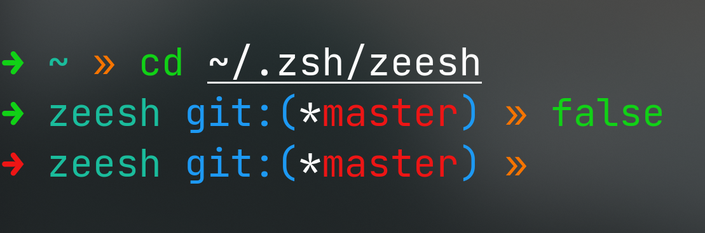
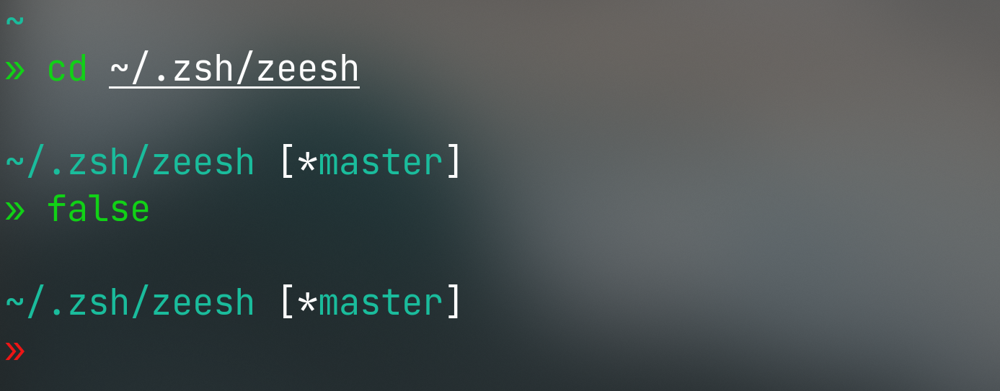
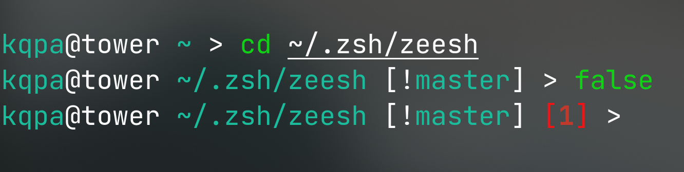
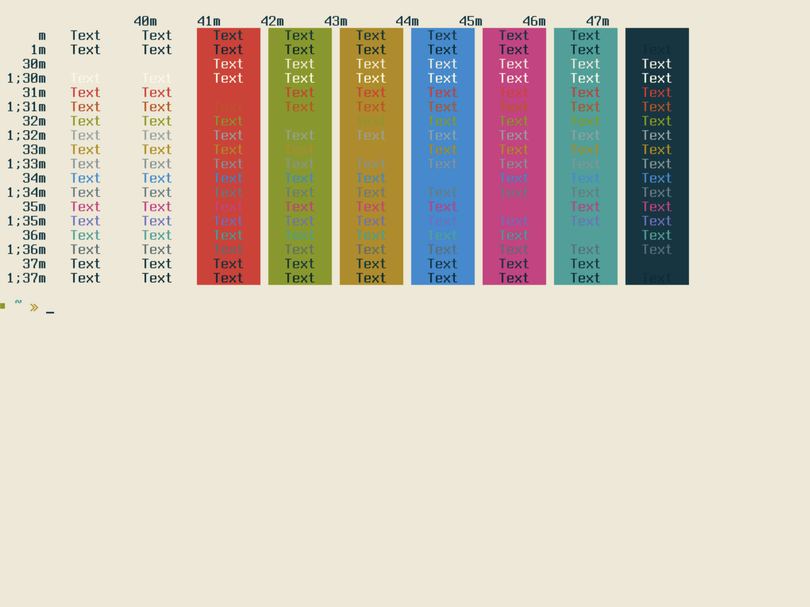
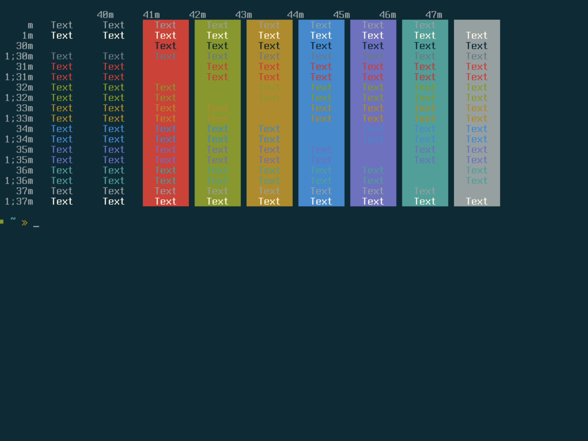
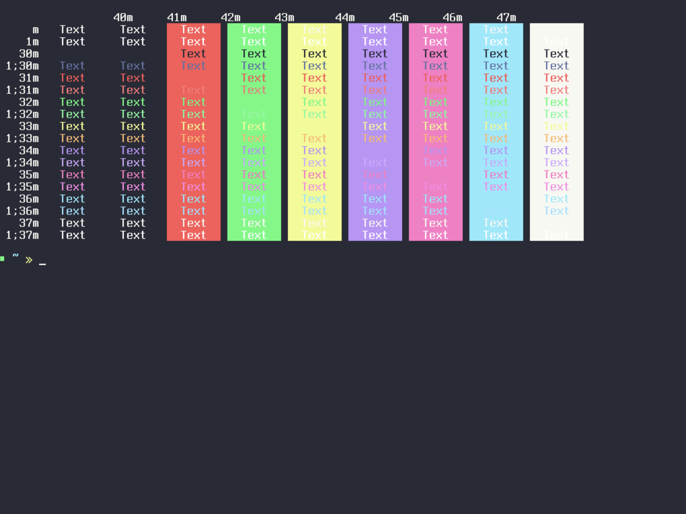
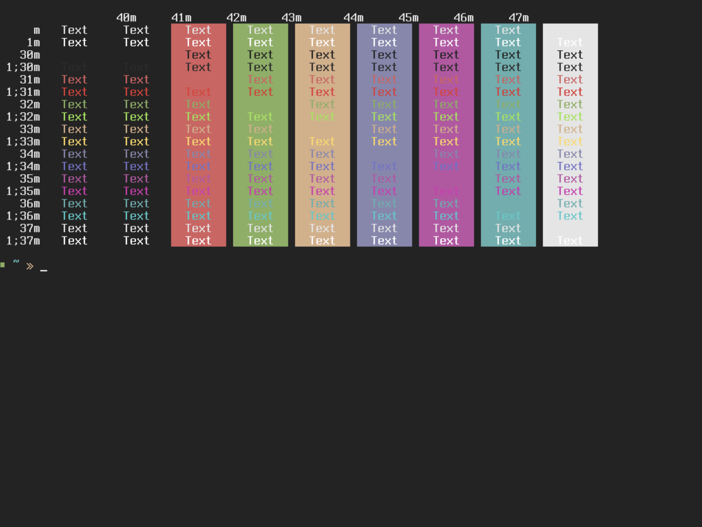

<div align="center">

# **zeesh**

A lightweight, fast and easy-to-use framework for the Z Shell.

```
▒▒▒▒ ▒▒   ▒▒▒▒ ▒▒   ▒▒▒▒ ▒▒
▒▒ ■ ▒▒   ▒▒ ■ ▒▒   ▒▒ ■ ▒▒
▒▒ ▒▒▒▒   ▒▒ ▒▒▒▒   ▒▒ ▒▒▒▒
```
## Installation

</div>

In order to install zeesh, you'll first need to have the following packages installed on your system:

> 1. [`zsh`](https://zsh.org/): Required for zeesh to function as a whole.
> 2. [`curl`](https://curl.se/): Used to run the installation script.
> 3. [`git`](https://git-scm.com/): Used to download the repository.

After ensuring that those packages are installed, run this command in your terminal:

<div align="center">

```sh
zsh -c "$(curl -s 'https://raw.githubusercontent.com/Kqpa/zeesh/master/.install.sh')"
```
## Information

</div>

- You can access the zeesh's configuration file by running `zeesh config`, and you should reload your shell configuration for your modifications to take effect.

- If you want to uninstall zeesh, run `zeesh uninstall` in your terminal and reload your shell configuration by running `source ~/.zshrc`.

- If you want to update your current zeesh installation, run `zeesh update` in your terminal and reload your shell configuration by running `source ~/.zshrc`.

- If you want to disable a shell script or a whole directory, you can add a dot before the file/folder. For example, if you want to disable [`./src/scripts/ccp.sh`](./src/scripts/ccp.sh), you can change the file name of `ccp.sh` to `.ccp.sh`. - If you want to disable a directory, let's say [`./src/scripts`](./src/scripts), you can change the directory name from `scripts` to `.scripts`.

<div align="center">

## Features

</div>

- zeesh ships itself with a lot of convinient shell aliases that are sourced from [`./src/aliases/*`](./src/aliases)
- zeesh has a lot of convinient shell scripts that allow you to automate tasks, which are sourced from [`./src/scripts/*`](./src/scripts).
- zeesh gives you the ability to tweak your terminal with pre-configured prompts & TTY themes.

<div align="center">

## Shell Prompts

</div>

- #### **Minimal**

<kbd>
  
</kbd>

- #### **Space**

<kbd>
  
</kbd>

- #### **Classic**

<kbd>
  
</kbd>

<div align="center">

## TTY Themes

</div>

- #### **Solarized Light**

<kbd>
  
</kbd>

- #### **Solarized Dark**

<kbd>
  
</kbd>

- #### **Dracula Dark**

<kbd>
  
</kbd>

- #### **Soft Dark**

<kbd>
  
</kbd>
